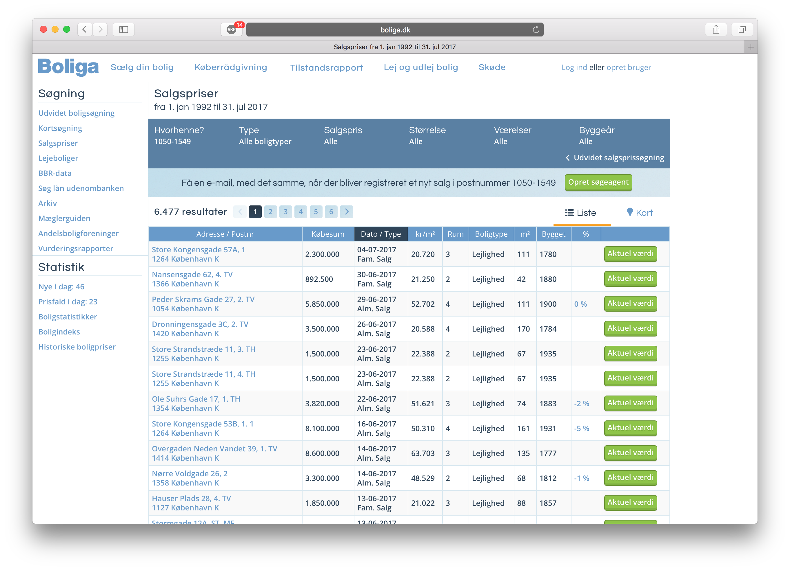

# Assignment 2: Data Collection

Your task is to scrape a complete dataset of historical Danish housing sales data.

The data comes originally from http://www.boliga.dk/salg. Navigate to that page and select for example `1050-1049 København K` as `Postnr:` and `1992` as `Vejnavn:` (just keep `Boligtype:` and `Fra:` field with their default values). After hitting the green `Søg` button, you will be directed to a page with the following URL http://www.boliga.dk/salg/resultater?so=1&sort=omregnings_dato-d&maxsaledate=today&iPostnr=1050-1549&gade=&type=&minsaledate=1992  and that looks similar to the following:


On that page you will find a paginated list with 40 entries per page and in total more than 6400 historical housing sales records for Copenhagen's city center.


To scrape the complete dataset, you have to store all Danish housing sales records from 1992 to now.


## Task
  1. Scrape a complete dataset of historical Danish housing sales data from `http://<IP>/boliga.
  2. Save your scraped results in either one or many CSV files, where the CSV files have a header like `address,zip_code,price,sell_date,sell_type,price_per_sq_m,no_rooms,housing_type,size_in_sq_m,year_of_construction,price_change_in_pct` corresponding to the header of the tables in the HTML pages _Adresse / Postnr | Købesum | Dato / Type | kr/m² | Rum | Boligtype | m² | Bygget | %_
  Furthermore, each row in a table of an HTML page becomes a row in a corresponding CSV file.
  3. Count the amount of scraped housing data sales records from your CSV files.


## Hints

  1. **OBS:** _**Do not**_ scrape directly from boliga.dk as this might put a too high load on their servers and as they might block your IP. Instead scrape the data from a mirror http://<TODO: insert server IP>/boliga. On that mirror you will find an HTML pages that have a name like `<ZIP_NUMBER>_<PAGE_INDEX>.html` for example `http://<IP>/boliga/4000_2.html` or `http://165.227.137.1/boliga/1050-1049_1.html`.
  2. Make your scraper robust, so that it does not crash in case of unexpectet values in a sales record.
  3. In case you saved your scraped data in a CSV file per ZIP code, you can count the lines per file and receive a total line count with the help of the `find`and `xagrs` commands, e.g., `$ find . -name '*.csv' | xargs wc -l`. Otherwise, in case you have a single CSV file you can count the lines directly via `$ cat boliga_all.csv | wc -l`

  In the former case you should get counts similar to the following:

  ```bash
  $ find . -name '*.csv' | xargs wc -l
      6233 ./boliga_1050-1549.csv
     3714 ./boliga_1550-1799.csv
      7923 ./boliga_1800-1999.csv
     16744 ./boliga_2000.csv
     26310 ./boliga_2100.csv
     26700 ./boliga_2150.csv
  ...
       741 ./boliga_9981.csv
      1404 ./boliga_9982.csv
      3258 ./boliga_9990.csv
   1385901 total
   ```